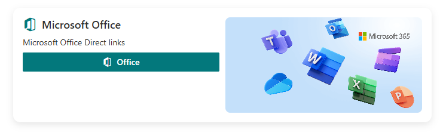

# 4-Button Popup (SPFx • Fluent UI Card)

A modern, configurable **Fluent UI Card** built with **SPFx** that lets authors set a **title**, **description**, a **main action button**, and **four link buttons** (each with **name**, **icon**, and **URL**) directly from the **Property Pane**.  
Clicking the main button opens a **right-side Panel** that lists all configured actions; selecting an item navigates to its configured link.


## 🖼️ Screenshots

### Card View


### Right Popup Panel


---

## 📦 Project Metadata

- **Name:** Project 4-button-popup  
- **Version:** `0.0.1`  
- **Build tools version:** `3.19.0`  
- **SPFx:** `1.21.1`  
- **React:** `17.0.1`  
- **Fluent UI (React v8):** `^8.125.1`  
- **TypeScript:** `~5.3.3`  
- **Node (dev logs):** `v22.20.0` ⟶ **Note:** SPFx `1.21.x` works best on **Node 18 LTS**  
- **Total build duration (log):** `~1.35 min`  
- **Task warnings (log):** `5`

Badges:

!SPFx 1.21.1
.
- ⚙️ **Property Pane configuration**:
  - Title & Description
  - Main Button (label)
  - **Four Link Buttons** — each with **Text**, **Icon (MDL2 name)**, and **URL**
- 🧩 **Right-side Panel** pops on main button click, listing configured buttons.
- 🔗 Clicking any item **navigates** to its configured link.
- ♿ Accessible, responsive, and focused on SharePoint Online.

---

## 🧰 Tech Stack

- **SharePoint Framework (SPFx):** `1.21.1`
- **React:** `17.0.1`
- **Fluent UI (React v8):** `^8.125.1`
- **Tooling:** Gulp 4, ESLint, TypeScript ~5.3

> Key dependencies:
>
> ```json
> "dependencies": {
>   "@fluentui/react": "^8.125.1",
>   "@microsoft/sp-component-base": "1.21.1",
>   "@microsoft/sp-core-library": "1.21.1",
>   "@microsoft/sp-lodash-subset": "1.21.1",
>   "@microsoft/sp-office-ui-fabric-core": "1.21.1",
>   "@microsoft/sp-property-pane": "^1.21.1",
>   "@microsoft/sp-webpart-base": "1.21.1",
>   "react": "17.0.1",
>   "react-dom": "17.0.1",
>   "tslib": "2.3.1"
> }
> ```

---

## ✅ Prerequisites

- **Node.js:** Prefer **Node 18.x LTS** for SPFx `1.21.x` projects.
- **Gulp CLI:** `npm i -g gulp`
- **Yeoman & SPFx generator** (optional if scaffolding): `npm i -g yo @microsoft/generator-sharepoint`
- **Office 365 tenant** with App Catalog (for deployment to SharePoint Online).

> ⚠️ **Note about Node 22:** If your dev logs show Node `v22.20.0`, you may hit build or type issues on SPFx 1.21.x. If you see errors, switch to **Node 18 LTS** (via nvm or volta) for best compatibility.

---

## 🚀 Getting Started

```bash
# 1) Install dependencies
npm install

# 2) (First time only) Trust dev certs for local workbench
gulp trust-dev-cert

# 3) Start the local server
gulp serve
``
